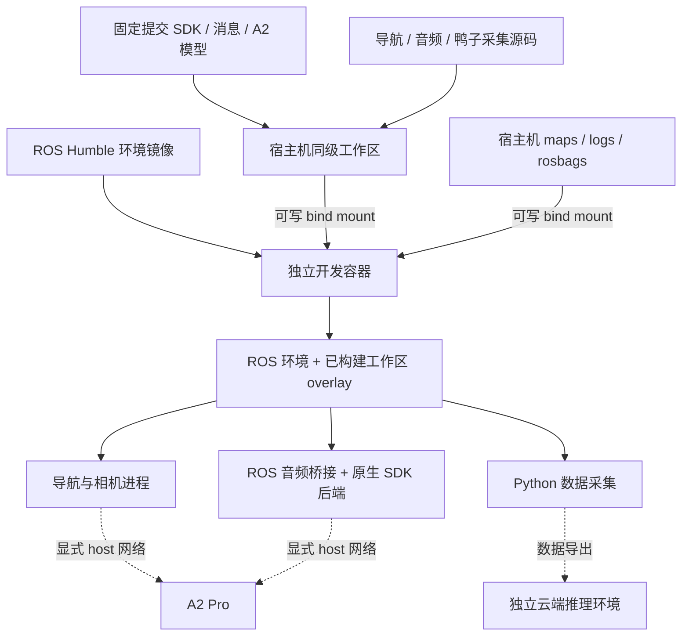

# 环境架构

镜像负责系统依赖；SDK、消息与 A2 模型用 Git 提交锁定，SDK 静态库另有二进制哈希校验；业务源码由各自 Git 仓库管理。容器入口只加载环境和执行传入命令，不自动启动 ROS 节点。默认 launcher 主进程为空闲等待，因此容器运行不代表导航、定位或音频功能已经启动。

`env.sh` 顺序加载 ROS Humble、导航 `install/local_setup.bash`、音频 `install/local_setup.bash`。首次构建前 overlay 不存在也可进入。构建后再次 source 环境以获得新包。鸭子云端 GPU 模型不是该 ROS 镜像的组成部分。
